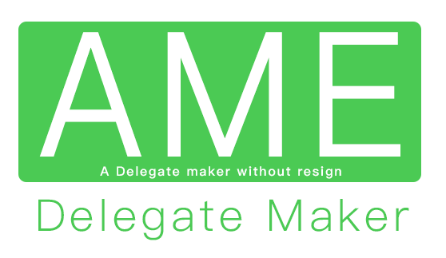
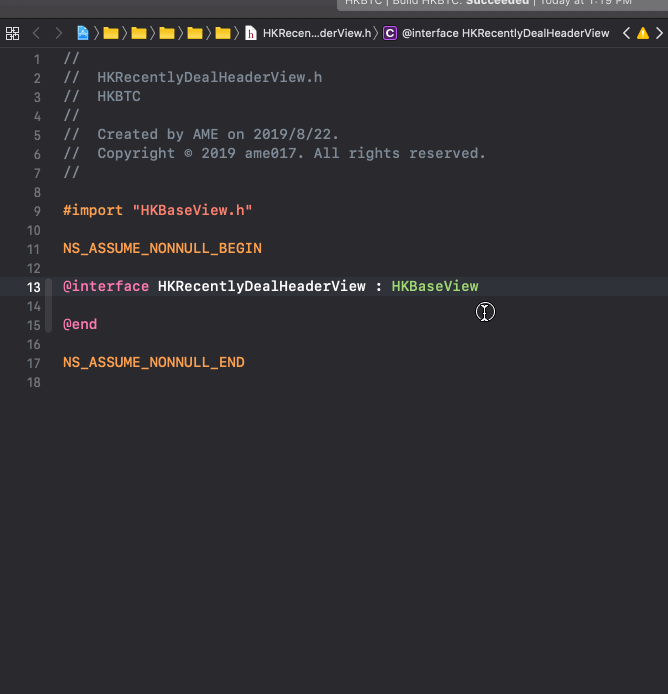
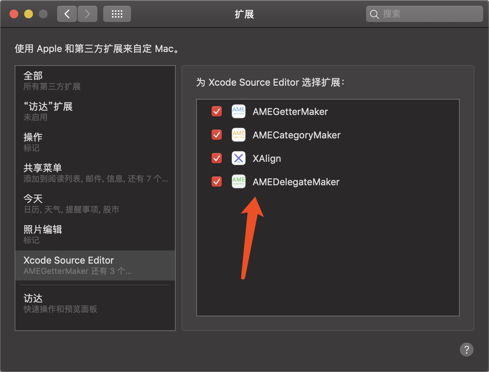
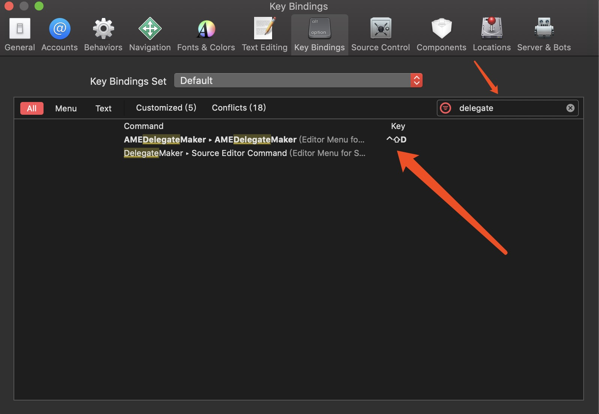

# AMEDelegateMaker
A Objective-c protocol &amp; delegate maker without resign for Xcode<br>



[](https://996.icu) [-blue.svg)](https://github.com/996icu/996.ICU/blob/master/LICENSE)

#####  Chinese (Simplified): [中文说明](README_chs.md)

## What is this?
This plug-in can help you create protocol & delegate easier.

e.g.
```
@interface HKRecentlyDealHeaderView : HKBaseView
```
↓↓↓
```
@class HKRecentlyDealHeaderView;
@protocol HKRecentlyDealHeaderViewDelegate <NSObject>

@required

@optional

- (void)hkrecentlyDealHeaderView:(HKRecentlyDealHeaderView *)view;

@end
@interface HKRecentlyDealHeaderView : HKBaseView

@property (nonatomic, weak) id<HKRecentlyDealHeaderViewDelegate> delegate;

@end
```


## Installation
1. [Download](product/AMEDelegateMaker.zip)<br>
2. Enable this plug-in in setting<br>

3. You can Bind shortcuts in Xcode setting <br>


## Trouble Shooting
If your Xcode is 8.0+.<br>
Please install macOS Sierra (version 10.12) if your macOS is 10.11.<br>

## Other project recommendations
[AMECategoryMaker](https://github.com/ame017/AMECategoryMaker) <br>
A category property maker without resigin<br>
[AMEGetterMaker](https://github.com/ame017/AMEGetterMaker) <br>
A lazyload getter maker without resign for Xcode
