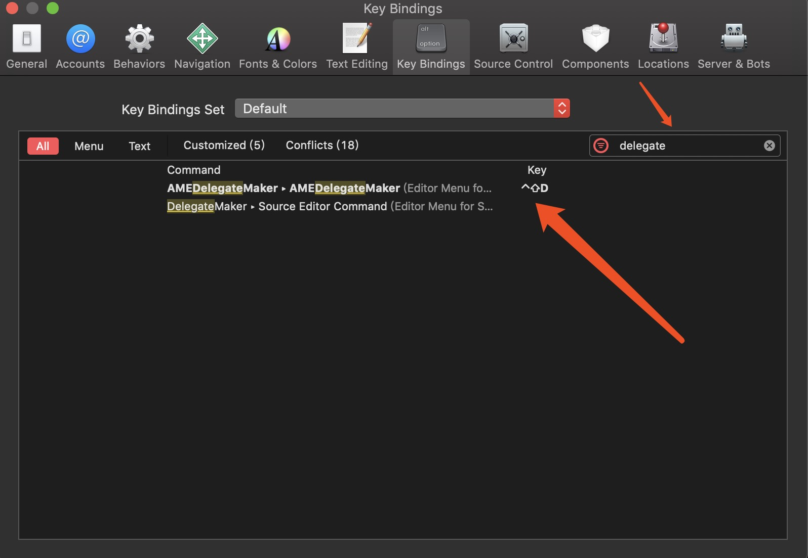

# AMEDelegateMaker
一个无需resgin的protocol和delegate生成器<br>


[](https://996.icu) [-blue.svg)](https://github.com/996icu/996.ICU/blob/master/LICENSE)


## What is this?
可以生成代理和协议

e.g.
```
@interface HKRecentlyDealHeaderView : HKBaseView
```
↓↓↓
```
@class HKRecentlyDealHeaderView;
@protocol HKRecentlyDealHeaderViewDelegate <NSObject>

@required

@optional

- (void)hkrecentlyDealHeaderView:(HKRecentlyDealHeaderView *)view;

@end
@interface HKRecentlyDealHeaderView : HKBaseView

@property (nonatomic, weak) id<HKRecentlyDealHeaderViewDelegate> delegate;

@end
```


## Installation
1. [点击这里下载](Product/AMEDelegateMaker.zip)<br>
2. 在设置中启用本扩展<br>

3. 你可以自己加个快捷键 <br>


## 问题
如果你使用Xcode8.0+.<br>
请把系统版本升级到10.12以上.<br>

## 其他推荐
[AMECategoryMaker](https://github.com/ame017/AMECategoryMaker) <br>
类别(category)生成器<br>
[AMEGetterMaker](https://github.com/ame017/AMEGetterMaker) <br>
懒加载生成器
